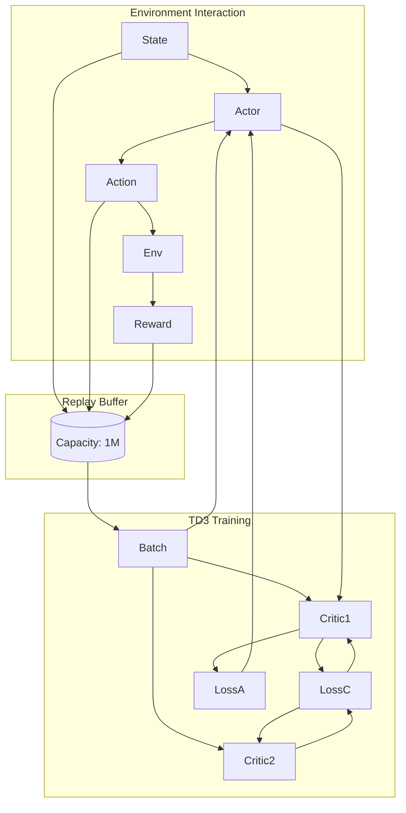

# 🤖 Autonomous Robotic Arm Control  
### Reinforcement Learning with TD3

<p align="center">
  
</p>

<p align="center">
  <b>Training a Franka Panda robot to open a door using Twin Delayed DDPG (TD3)</b>
</p>

<p align="center">
  
  
  
  
</p>

---

## 🧭 Project Summary

This project explores **continuous control in robotics** using Deep Reinforcement Learning.  
An agent is trained in a high-fidelity simulation to solve the **Door Opening Task** using the **TD3 algorithm**.

The robot learns to:
- Reach the handle  
- Grasp it  
- Rotate it  
- Open the door  

All from scratch — without demonstrations.

---

## ⚙️ Tech Stack

| Component        | Tool |
|------------------|------|
| RL Algorithm     | TD3 (Twin Delayed DDPG) |
| Simulator        | Robosuite (MuJoCo) |
| Framework        | PyTorch |
| Robot            | Franka Emika Panda |

---

## 🚀 Highlights

- 🧠 **TD3 Implementation**  
  Reduces overestimation bias with twin critics and delayed updates  

- 🦾 **Realistic Simulation**  
  Physics-based environment using Robosuite  

- 📈 **Stable Learning**  
  Achieves consistent performance (~275 reward)  

- 💾 **Training Safety**  
  Includes checkpointing & best-model saving  

---

## 📊 Training Results

The model was trained for **8500+ episodes**, showing a clear progression from exploration to mastery.

<p align="center">
  
</p>

---

## 🏗️ Project Structure

```
## 🏗️ Project Structure
## 🏗️ Project Structure

```
.
├── Assets/             # Demo GIFs, training graphs
├── .gitignore          # Git ignore rules
├── README.md           # Project documentation
├── best_score.txt      # Stores best achieved reward
├── buffer.py           # Replay buffer implementation
├── capture_demo.py     # Script to record demo videos
├── checkpoint.txt      # Training checkpoint tracking
├── main.py             # Training entry point
├── networks.py         # Actor & Critic neural networks
├── requirements.txt    # Dependencies
├── td3_torch.py        # TD3 algorithm implementation
└── test.py             # Run trained agent
```
---

## ⚡ Getting Started

### 1. Clone Repository
```bash
git clone https://github.com/ranjitsatpute/Intelligent-Robotic-Arm-Control-via-Reinforcement-Learning.git
cd Autonomous-Robotic-Arm-Control-using-Reinforcement-Learning
```

### 2. Setup Environment
```bash
python -m venv venv
venv\Scripts\activate      # Windows
# source venv/bin/activate # Linux / Mac
```

### 3. Install Dependencies
```bash
pip install -r requirements.txt
```

---

## ▶️ How to Run

### 🔍 Test Trained Agent
```bash
python test.py
```

### 🏋️ Train from Scratch
```bash
python main.py
```

---

## 🧠 TD3 Architecture



---

## 📚 References

- TD3 Paper: https://arxiv.org/abs/1802.09477  
- Robosuite: https://robosuite.ai/

---

## 👤 Author

**Ranjit Satpute**

---

## ⭐ Contributing / Feedback

If you find this project useful:
- ⭐ Star the repo  
- 🛠️ Suggest improvements  
- 🧠 Share ideas  

---

## 🧾 License

This project is licensed under the **MIT License**.
